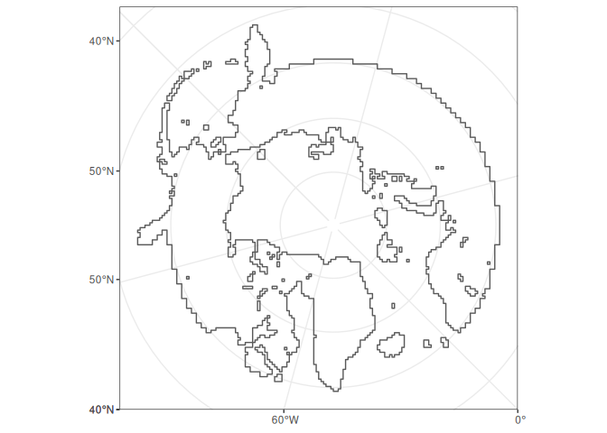
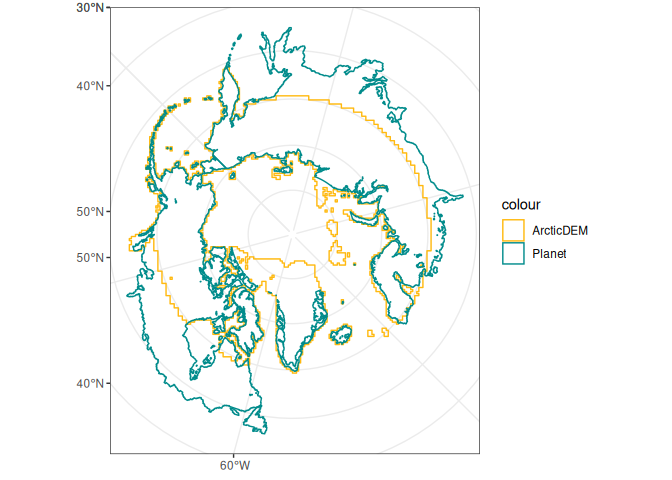
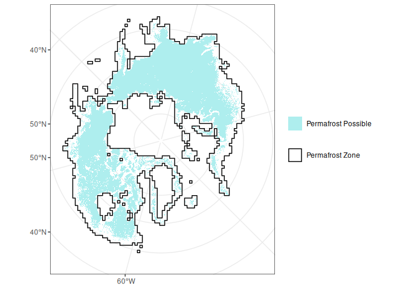
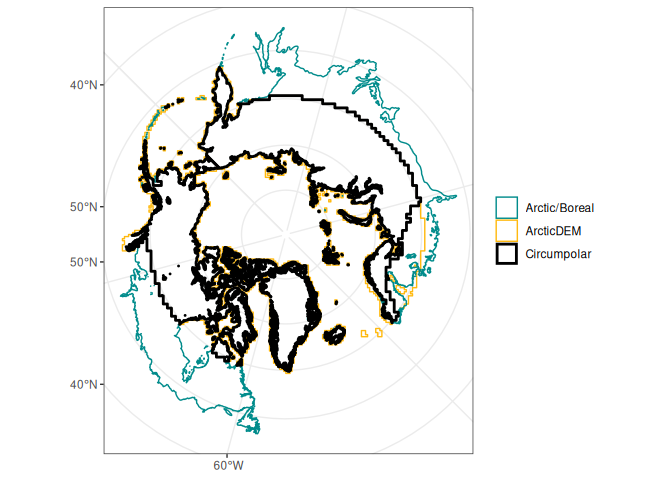
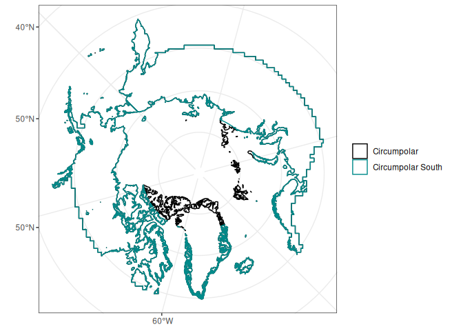
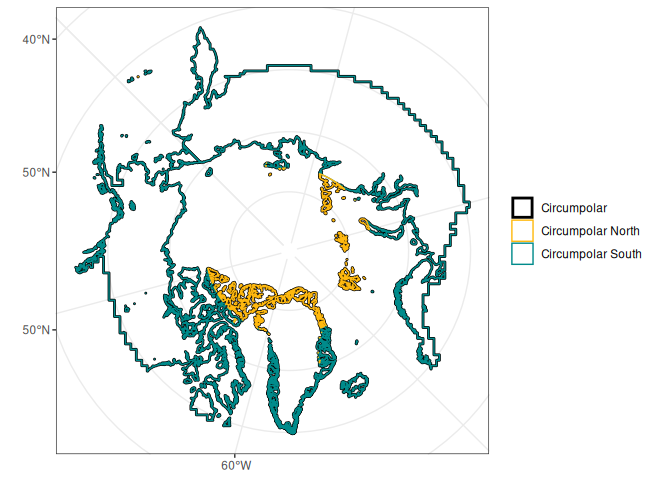
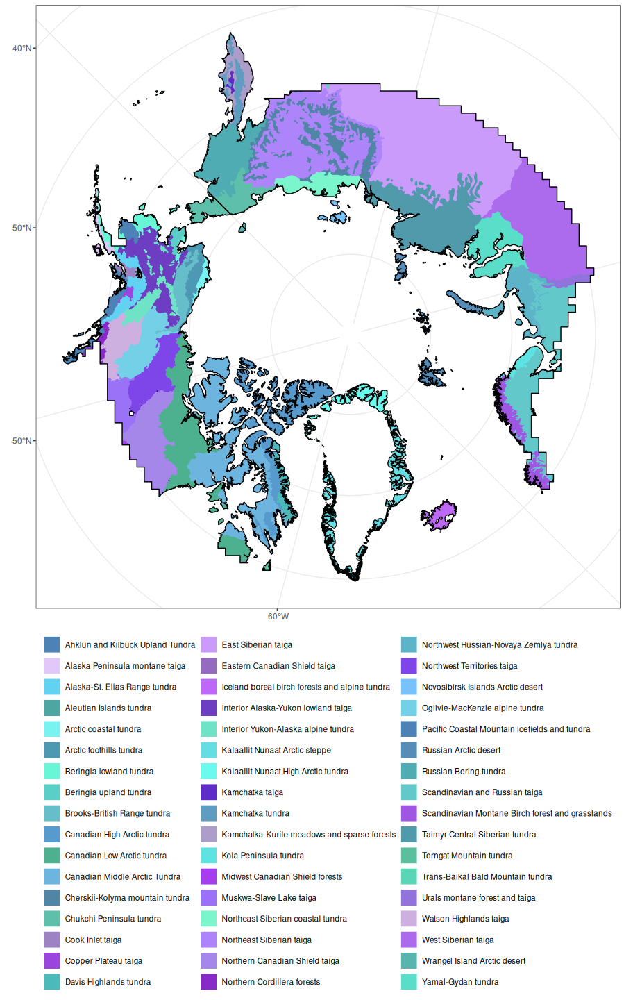
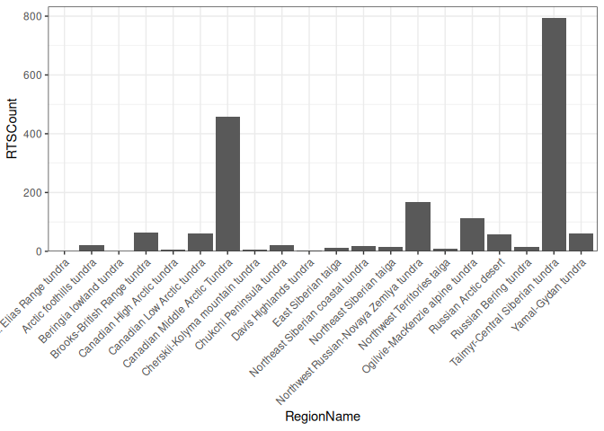
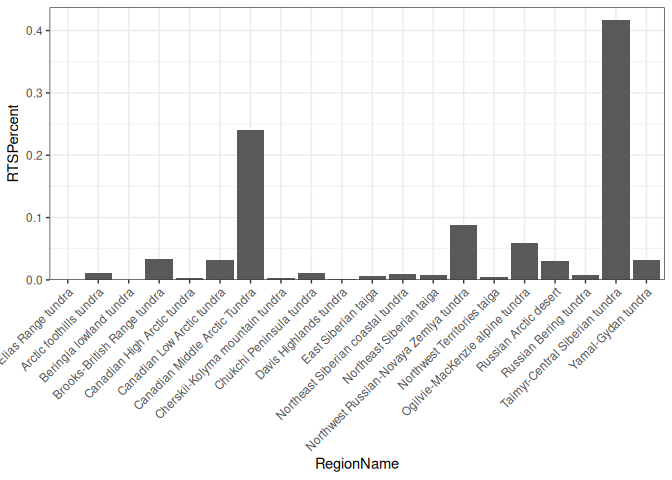

# Inference Domain and Subregions
Heidi Rodenhizer

This document describes the process of creating the inference domain
over which RTS will be mapped in RTSMapping_v2. This domain is based on
the intersection between the Arctic boreal region, the permafrost
region, and the ArcticDEM v4 Mosaic. Additionally, it was split into a
northern and southern domain based on the extent of PlanetScope Global
Quarterly Visual Basemaps which are only guaranteed to 74 degrees N (but
actually extend to approximately 76 degrees N in most cases).

# Import Data

## Domain

``` r
# ArcticDEM
arctic_dem = st_read(
  "./domain/data/ArcticDEM_Mosaic_Index_latest_shp/ArcticDEM_Mosaic_Index_v4_1_2m.shp"
) |>
  separate_wider_delim(
    tile,
    delim = "_",
    names = c("superrow", "supercolumn", "row", "column"),
    cols_remove = FALSE
  ) |>
  mutate(across(superrow:column, ~ as.numeric(.x))) |>
  rowwise() |>
  mutate(geometry = fix_geometry_at_origin(geometry, column)) |>
  ungroup() |>
  st_as_sf()

# # Planet Grids
# planet_grids = st_read(
#   "./domain/data/arctic_boreal_planet_basemap_grids.geojson"
# ) |>
#   st_make_valid() |>
#   rowwise() |>
#   mutate(geometry = round_coordinates(geometry, 5)) |>
#   ungroup()

# Planet Domain (derived from Planet Grids)
planet_domain = st_read("./domain/data/circumpolar_planet_domain.geojson") |>
  st_transform(crs = st_crs(arctic_dem))
arctic_boreal = st_read(
  "./domain/data/tundra_and_boreal/tundra_and_boreal.shp"
) |>
  st_transform(crs = st_crs(arctic_dem)) |>
  st_union() |>
  st_as_sf()

# Permafrost Probability
template = rast(
  xmin = -5000000,
  xmax = 5000000,
  ymin = -5000000,
  ymax = 5000000,
  crs = "EPSG:3413",
  resolution = 1000
)
perm_prob = rast("./domain/data/NIEER_Probability.tif") |>
  project(template)
```

## Subregions

Ecoregions from Dinerstein et al. 2017 will be used as the starting
point for our subregions.

``` r
ecoregions = st_read("./domain/data/Ecoregions2017/Ecoregions2017.shp") |>
  st_transform(crs = st_crs(arctic_dem)) |>
  mutate(
    across(
      c(-geometry),
      ~ case_when(
        .x == "N/A" ~ NA,
        TRUE ~ .x
      )
    )
  )

training_polys = st_read(
  "./domain/data/planet_perfect_polygons_union_result.geojson"
) |>
  st_transform(st_crs(arctic_dem))
```

# Domain

## Dissolve Internal Boundaries

### ArcticDEM

``` r
arcdem_domain = arctic_dem |>
  summarise(geometry = st_union(geometry))
```



### Planet Grids

``` r
# planet_domain = planet_grids |>
#   summarise(geometry = st_union(geometry)) # |>
```



## Prepare Permafrost Extent Map

The permafrost probability map is highly spotty. We are including any
areas that fall within the Arctic boreal region and have some coverage
of permafrost within a 100 x 100 km pixel.

``` r
perm_prob[perm_prob > 0] = 1
perm_prob[is.na(perm_prob)] = 0
perm_prob_sf = perm_prob |>
  crop(arctic_boreal) |>
  mask(arctic_boreal) |>
  aggregate(
    fact = 100,
    fun = any_ones
  ) |> # Check if there is any probability of permafrost within 100 km
  as.polygons() |>
  st_as_sf()
perm_prob[perm_prob == 0] = NA
```

    <SpatRaster> resampled to 501264 cells.



## Circumpolar Domain

We started with the Arctic Boreal region that Anna V made to create our
circumpolar region. This region is first reduced by taking the
intersection with the ArcticDEM, because we need data from the
ArcticDEM. It is further reduced by taking the intersection with the
permafrost zone, because permafrost is a necessary precursor for RTS.

``` r
circumpolar = arctic_boreal |>
  st_intersection(arcdem_domain) |>
  st_intersection(perm_prob_sf)
```

    Warning: attribute variables are assumed to be spatially constant throughout
    all geometries



## Circumpolar South Domain

This is the portion of the ArcticDEM for which we have Planet imagery.

``` r
circumpolar_south = circumpolar |>
  st_intersection(planet_domain)
```

    Warning: attribute variables are assumed to be spatially constant throughout
    all geometries



## Circumpolar North Domain

This is the portion of the Circumpolar region for which we do not have
Planet data.

``` r
circumpolar_north = circumpolar |>
  st_difference(planet_domain)
```

    Warning: attribute variables are assumed to be spatially constant throughout
    all geometries



# Subregions

## Clip to Domain

The ecoregions from Dinerstein et al. 2017 need to be clipped to the
circumpolar region created above.

``` r
subregions = ecoregions |>
  filter(BIOME_NAME %in% c("Tundra", "Boreal Forests/Taiga")) |>
  st_intersection(circumpolar) |>
  st_as_sf() |>
  select(ECO_NAME, COLOR) |>
  arrange(ECO_NAME)
```

    Warning: attribute variables are assumed to be spatially constant throughout
    all geometries



## Check Training Polygon Counts by Subregion

``` r
region_poly_count = training_polys |>
  st_join(
    subregions |>
      select(RegionName = ECO_NAME),
    join = st_nearest_feature
  ) |>
  st_drop_geometry() |>
  summarise(
    RTSCount = n(),
    .by = RegionName
  ) |>
  mutate(
    RTSPercent = RTSCount / sum(RTSCount)
  )
```





``` r
small_clusters_percent = region_poly_count |>
  filter(RTSPercent < 0.1) |>
  summarise(TotalPercentSmallClusters = sum(RTSPercent))
small_clusters_percent
```

      TotalPercentSmallClusters
    1                 0.3434874
