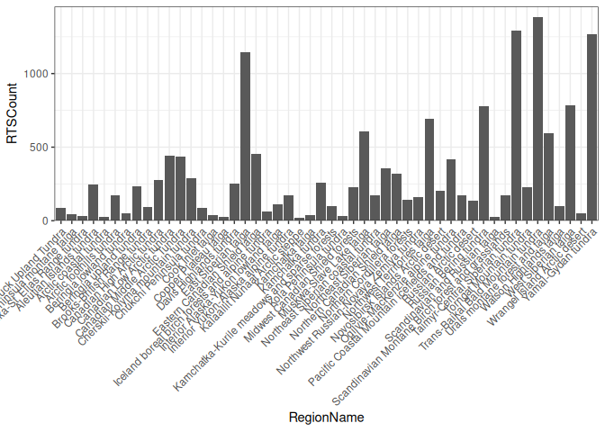
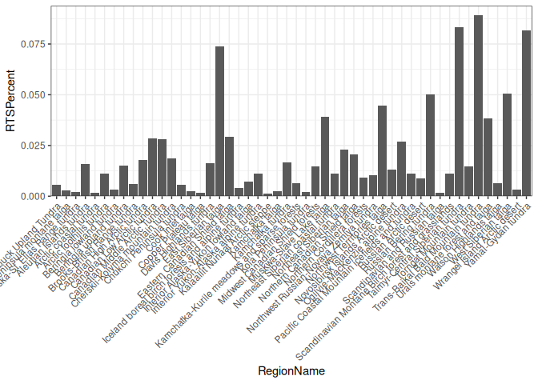
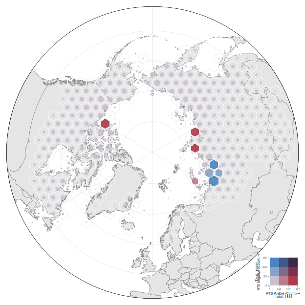

# Training Data Distribution

Heidi Rodenhizer

# Check Training Polygon Counts by Subregion

``` r
region_train_count = train_meta |>
  summarise(
    RTSCount = n(),
    .by = RegionName
  ) |>
  mutate(
    RTSPercent = RTSCount / sum(RTSCount)
  ) |>
  arrange(-RTSPercent)
region_train_count
```

```         
# A tibble: 50 × 3
   RegionName                        RTSCount RTSPercent
   <chr>                                <int>      <dbl>
 1 Trans-Baikal Bald Mountain tundra     1386     0.0893
 2 Taimyr-Central Siberian tundra        1294     0.0834
 3 Yamal-Gydan tundra                    1270     0.0819
 4 East Siberian taiga                   1145     0.0738
 5 West Siberian taiga                    784     0.0505
 6 Russian Bering tundra                  780     0.0503
 7 Northwest Territories taiga            692     0.0446
 8 Muskwa-Slave Lake taiga                610     0.0393
 9 Urals montane forest and taiga         593     0.0382
10 Eastern Canadian Shield taiga          452     0.0291
# ℹ 40 more rows
```





``` r
small_clusters_percent = region_train_count |>
  filter(RTSPercent < 0.1) |>
  summarise(TotalPercentSmallClusters = sum(RTSPercent))
small_clusters_percent
```

```         
# A tibble: 1 × 1
  TotalPercentSmallClusters
                      <dbl>
1                         1
```

# Map Training Data

## Convert metadata to sf

``` r
train_points = train_meta %>%
  st_as_sf(coords = c("centroid_lon", "centroid_lat"), crs = 4326) %>%
  st_transform(crs = 6931) %>%
  bind_cols(st_coordinates(.)) |>
  mutate(
    RTS = as.integer(case_when(
      TrainClass == "positive" ~ 1,
      TrainClass == "negative" ~ 0
    )),
    NoRTS = as.integer(case_when(
      TrainClass == "positive" ~ 0,
      TrainClass == "negative" ~ 1
    ))
  )

rts_points = train_points |>
  filter(TrainClass == "positive")

neg_points = train_points |>
  filter(TrainClass == "negative")

# train_bboxes = train_points |>
#   st_buffer(dist = 4.77 * 256, endCapStyle = "SQUARE")
```

``` r
# st_write(train_points, "./domain/train_points.geojson")
```

## Create hex grid

``` r
train_hex = train_points |>
  st_make_grid(
    cellsize = sqrt((100000 * 2) / (3 * sqrt(3))) * sqrt(3) * 1000, # get short side length of hexagon from area == 10000 km^2, and convert to m
    square = FALSE
  ) |>
  st_as_sf() |>
  rename(geometry = x) |>
  st_join(train_points, left = FALSE) |>
  summarize(
    Count = n(),
    RTSCount = sum(RTS),
    NoRTSCount = sum(NoRTS),
    .by = c(geometry)
  ) |>
  bi_class(
    x = RTSCount,
    y = NoRTSCount,
    style = "equal",
    dim = 3
  ) |>
  mutate(
    Buffer = (sqrt((100000 * 2) / (3 * sqrt(3))) * sqrt(3) * 1000) /
      2 *
      (0.9 - sqrt(Count / max(Count)) * 0.9), # use this ratio to scale the hexagons by total count: hexagon short side length * percentile of total count
    geometry_scaled = st_buffer(geometry, dist = Buffer * -1) # geometry of scaled hexagons
  )
```

## Map

### Custom palette

``` r
custom_pal3 <- c(
  "1-1" = "#CABED0", # low x, low y
  "2-1" = "#BC7C8F",
  "3-1" = "#AE3A4E", # high x, low y
  "1-2" = "#89A1C8",
  "2-2" = "#806A8A", # medium x, medium y
  "3-2" = "#77324C",
  "1-3" = "#4885C1", # low x, high y
  "2-3" = "#435786",
  "3-3" = "#3F2949" # high x, high y
)
```

### Legend

``` r
total_counts = train_points |>
  st_drop_geometry() |>
  summarise(n = n(), .by = c(TrainClass)) |>
  mutate(
    n = paste("Total:", n),
    x = c(-0.9, 2),
    y = c(2, -0.65),
    angle = c(90, 0)
  )

legend <- bi_legend(
  pal = custom_pal3,
  dim = 3,
  xlab = "RTS Positive (Count)",
  ylab = "RTS Negative (Count)",
  size = 5,
  breaks = bi_class_breaks(
    train_hex,
    x = RTSCount,
    y = NoRTSCount,
    style = "equal",
    dim = 3,
    split = TRUE
  )
) +
  geom_text(
    data = total_counts,
    aes(x = x, y = y, angle = angle, label = n),
    size = 1.85
  ) +
  coord_fixed(
    xlim = c(0.5, 3.5),
    ylim = c(0.5, 3.5),
    clip = "off"
  ) +
  theme(
    plot.margin = margin(6, 5, 6, 10),
    plot.background = element_rect(
      fill = fill_alpha("white", 0)
    )
  )
```

```         
Coordinate system already present.
ℹ Adding new coordinate system, which will replace the existing one.
```

``` r
# legend
```

### Map

``` r
train_hexplot = ggplot(world_north) +
  geom_sf(
    data = long_lines,
    color = 'gray90',
    linewidth = 0.25
  ) +
  geom_sf(
    data = lat_lines,
    color = 'gray90',
    linewidth = 0.25
  ) +
  geom_sf(
    color = 'gray50',
    fill = 'gray90'
  ) +
  geom_sf(
    data = train_hex,
    aes(geometry = geometry),
    fill = "transparent",
    color = "gray95",
    linewidth = 0.5
  ) +
  geom_sf(
    data = train_hex,
    aes(geometry = geometry_scaled, fill = bi_class),
    color = "transparent",
    alpha = 0.9
  ) +
  bi_scale_fill(pal = custom_pal3, dim = 3) +
  geom_sf(
    data = crop_poly,
    color = 'black',
    fill = 'transparent',
    linewidth = 0.25
  ) +
  # annotation_custom(
  #   ggplotGrob(legend),
  #   xmin = -Inf,
  #   xmax = 0.26,
  #   ymin = 0.55,
  #   ymax = Inf
  #   ) +
  scale_x_continuous(expand = expansion(mult = c(0.01, 0.01))) +
  scale_y_continuous(expand = expansion(mult = c(0.01, 0.01))) +
  coord_sf() +
  theme_void() +
  theme(
    legend.position = "none",
    # plot.margin = margin(10, 10, 10, 10) # trying to fix the outer circle getting cut off at top, bottom, left, and right
  )

inset_location = c(
  left = 0.62 + 0.21,
  bottom = 0.105 - 0.105,
  right = 0.79 + 0.21,
  top = 0.275 - 0.11
)

train_hexplot_title = train_hexplot +
  ggtitle("RTS Model v2 Training Data") +
  inset_element(
    legend,
    left = inset_location["left"],
    bottom = inset_location["bottom"],
    right = inset_location["right"],
    top = inset_location["top"]
  )

train_hexplot = train_hexplot +
  inset_element(
    legend,
    left = inset_location["left"],
    bottom = inset_location["bottom"],
    right = inset_location["right"],
    top = inset_location["top"]
  )
train_hexplot
```

